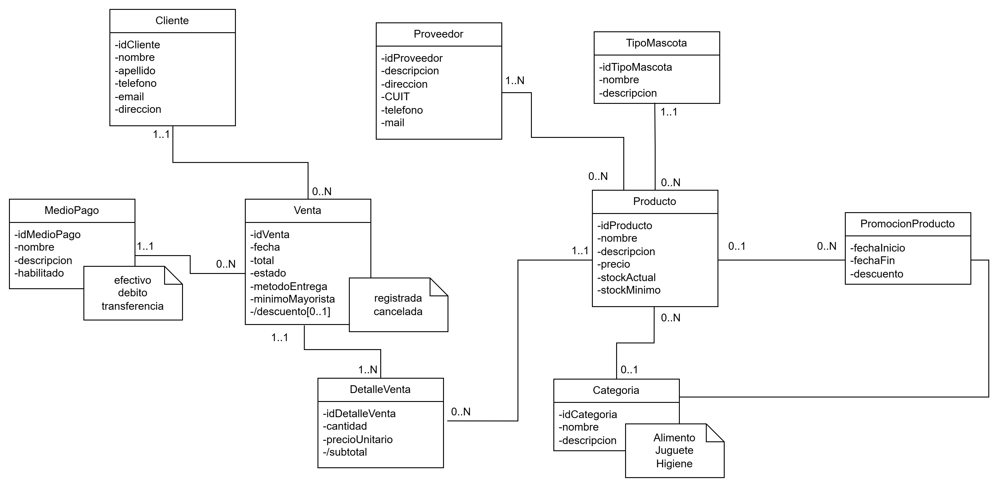

# Documentación

Punto de entrada de la documentación del proyecto (ver
[docs.md](../docs.md) en la raíz para el formato exigido por la cátedra).

## Instalación y ejecución

- [backend-instalacion.md](backend-instalacion.md) — instalación,
  configuración de ambiente y cómo levantar el servidor, datos de ejemplo.
- [frontend-instalacion.md](frontend-instalacion.md) — instalación,
  configuración de ambiente, cómo levantar el frontend y recorrido rápido
  para probarlo.

## Backend

- [backend-autenticacion.md](backend-autenticacion.md) — JWT, roles,
  matriz de permisos, usuarios de prueba.
- [backend-base-de-datos.md](backend-base-de-datos.md) — creación y
  evolución del esquema, esquema efectivo verificado, base de pruebas
  aislada.
- [backend-pruebas.md](backend-pruebas.md) — comandos y alcance de cada
  suite de pruebas del backend (sin base de datos vs. integración real).
- [backend-api.md](backend-api.md) — contrato completo de la API.

## Frontend

- [frontend-diseno.md](frontend-diseno.md) — referencia visual, sistema de
  diseño mobile-first, componentes reutilizables, servicios.
- [frontend-pruebas.md](frontend-pruebas.md) — pruebas unitarias/de
  componentes (Vitest) y de extremo a extremo (Playwright).

## Transversal

- [mapa-del-sistema.md](mapa-del-sistema.md) — pantalla → ruta API →
  controlador → servicio → modelo.
- [casos-de-uso.md](casos-de-uso.md) — registrar, cancelar y marcar como
  enviada una venta: actor, precondiciones, pasos, validaciones,
  transacciones, pruebas y ejemplo.
- [estado-proyecto.md](estado-proyecto.md) — qué está implementado,
  probado sin base, verificado, o pendiente, con la matriz de requisitos
  de regularidad y aprobación, y las decisiones de negocio pendientes de
  confirmación.

## Modelo de dominio

