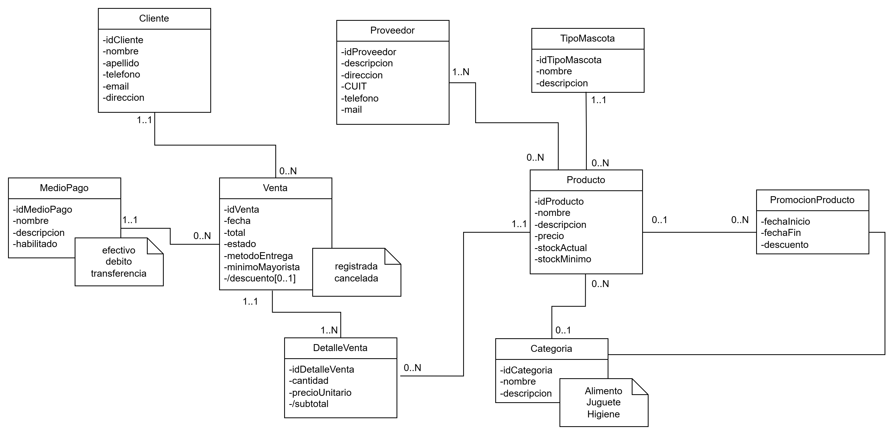

# Propuesta TP DSW

## Grupo
### Integrantes
* 52167 – Pérez, Mauro
* 50269 – Carrión Lescano, Leandro
* 52243 – Paz, José
* 48170 – Natalicchio, Oriana

### Repositorios
* [frontend app](http://hyperlinkToGihubOrGitlab)
* [backend app](http://hyperlinkToGihubOrGitlab)
*Nota*: si utiliza un monorepo indicar un solo link con fullstack app.

## Tema
### Descripción
Sistema web orientado a la gestión de productos para mascotas, clientes y ventas. Permite administrar el stock, registrar ventas y consultar historiales de consumo, mejorando la organización y control del negocio.

### Modelo

## Alcance Funcional 

### Alcance Mínimo

Regularidad:
|Req|Detalle|
|:-|:-|
|CRUD simple|1. CRUD Cliente 2. CRUD Proveedor 3. CRUD Producto  4. CRUD TipoMascota|
|CRUD dependiente|1. CRUD Producto {depende de} CRUD Categoría y CRUD TipoMascota 2. CRUD PromocionProducto {depende de} CRUD Producto y CRUD TipoCategoria|
|Listado + detalle|1. Listado de productos filtrado por categoría o tipo de mascota, muestra nombre, precio y stock ⇒ detalle muestra información completa del producto 2. Listado de ventas filtrado por cliente o proveedor, muestra fecha, cliente, proveedor y total ⇒ detalle muestra información completa de la venta y productos asociados|
|CUU/Epic|1. Registrar una venta. 2. Cancelar una venta.

Adicionales para Aprobación
|Req|Detalle|
|:-|:-|
|CRUD|1. CRUD Cliente 2. CRUD Proveedor 3. CRUD Producto  4. CRUD TipoMascota 5. CRUD Categoria 6. CRUD MedioPago 7. CRUD PromocionProducto  8. CRUD Venta  9. CRUD DetalleVenta|
|CUU/Epic|1. Registrar una venta. 2. Cancelar una venta. 3. Realizar el cambio de estado del pedido una vez enviado.|

### Alcance Adicional Voluntario

*Nota*: El Alcance Adicional Voluntario es opcional, pero ayuda a que la funcionalidad del sistema esté completa y será considerado en la nota en función de su complejidad y esfuerzo.

|Req|Detalle|
|:-|:-|
|Listados |1. Listado de productos con stock por debajo del mínimo definido|
|CUU/Epic|1. Consultar productos recomendados según el tipo de mascota|
|Otros|1. Visualización de alertas de stock bajo en productos.   2. Enviar recordatorio de pedido no pagado luego de un determinado tiempo.|
